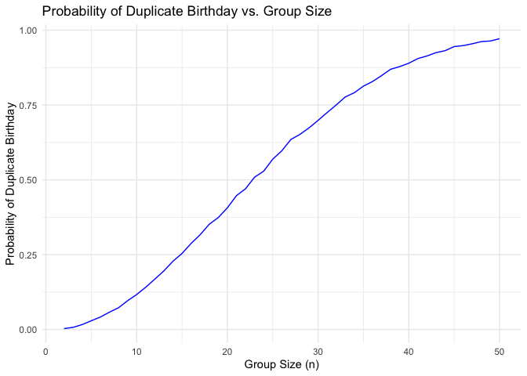
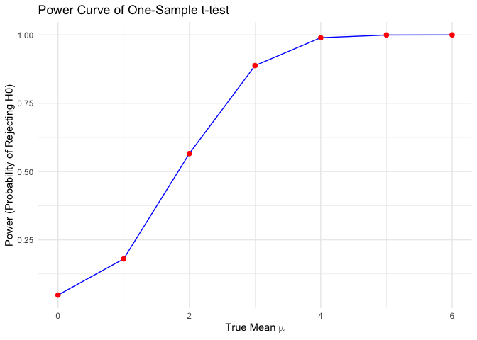
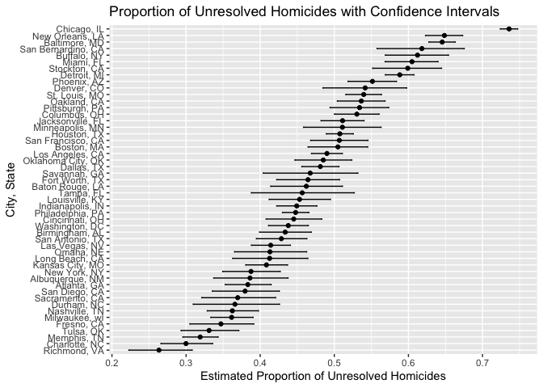

p8105_hw5_mw3845
================
Minghe Wang
2024-11-14

# Problem 1

``` r
check_duplicate_bd <- function(n) {
  # Simulate uniformly distributed birthday with size n
  birthdays <- sample(1:365, n, replace = TRUE)
  # Check duplicate
  return(any(duplicated(birthdays)))
}
#Simulate each size 10000 times
sim_num = 10000
group_size = 2:50
prob = numeric(length(group_size))

for (i in seq_along(group_size)){
  n = group_size[i]
  results = replicate(sim_num, check_duplicate_bd(n))
  prob[i] = mean(results)
}

########################
#test
data <- data.frame(GroupSize = group_size, Probability = prob)

# Create the plot
ggplot(data, aes(x = GroupSize, y = Probability)) +
  geom_line(color = 'blue') +
  #geom_point(color = 'blue') +
  labs(title = 'Probability of Duplicate Birthday vs. Group Size',
       x = 'Group Size (n)',
       y = 'Probability of Duplicate Birthday') +
  theme_minimal()
```

<!-- -->

In this problem, we simulate a problem to measure the probability of
duplicate birthday among the group of `n` people. According to the plot,
we see a positive relationship between `group_size` and
`probability_of_duplicate_birthday`. The result aligns with our
intuition that with more people in a group, there are more likely to be
people with duplicate birthday.

# Problem 2

``` r
#fixed parameters for simulation
n = 30                              #fixed sample size
sigma = 5                           #fixed sigma
ds_num = 5000                       #fixed number of datasets
alpha = 0.05

#Write function to get estimate and p-value for each dataset
sim_estimate_pval = function(mu, n = 30, sigma = 5){
  
  sim_data = tibble(
    x = rnorm(n, mean = mu, sd = sigma)
  )
  
  t.test(sim_data$x, mu = 0) %>% 
    broom::tidy() %>% 
    select(estimate, p.value)
}

sim_results_df = 
  expand_grid(
    mu_vec = c(0, 1, 2, 3, 4, 5, 6),
    iter = 1:ds_num
  ) |> 
  mutate(
    estimate_df = map(mu_vec, sim_estimate_pval)
  ) |> 
  unnest(estimate_df)

sim_results_df |> 
  pivot_longer(
    estimate:p.value,
    names_to = "parameter", 
    values_to = "estimate") |> 
  group_by(parameter, mu_vec) |> 
  summarize(
    emp_mean = mean(estimate),
    emp_var = var(estimate)) |> 
  knitr::kable(digits = 5)
```

    ## `summarise()` has grouped output by 'parameter'. You can override using the
    ## `.groups` argument.

| parameter | mu_vec | emp_mean | emp_var |
|:----------|-------:|---------:|--------:|
| estimate  |      0 |  0.00343 | 0.81876 |
| estimate  |      1 |  0.97576 | 0.80081 |
| estimate  |      2 |  2.01126 | 0.86012 |
| estimate  |      3 |  2.99443 | 0.83346 |
| estimate  |      4 |  4.02374 | 0.85146 |
| estimate  |      5 |  4.98289 | 0.84990 |
| estimate  |      6 |  6.01582 | 0.82393 |
| p.value   |      0 |  0.50076 | 0.08290 |
| p.value   |      1 |  0.35301 | 0.08953 |
| p.value   |      2 |  0.11915 | 0.03632 |
| p.value   |      3 |  0.02409 | 0.00514 |
| p.value   |      4 |  0.00288 | 0.00021 |
| p.value   |      5 |  0.00035 | 0.00001 |
| p.value   |      6 |  0.00002 | 0.00000 |

With the table containing empirical mean and variance for estimate and
p-value, we expect an positive association between the power and $\mu$
because the p-value decreases as $\mu$ increases. This assumption will
be verified in later part.

``` r
power_df <- sim_results_df %>%
  group_by(mu_vec) %>%
  summarize(
    power = mean(p.value < alpha)
  )

ggplot(power_df, aes(x = mu_vec, y = power)) +
  geom_line(color = 'blue') +
  geom_point(color = 'red', size = 2) +
  labs(title = 'Power Curve of One-Sample t-test',
       x = expression('True Mean ' * mu),
       y = 'Power (Probability of Rejecting H0)') +
  theme_minimal()
```

<!-- -->

By calculating the proportion of times the null hypothesis was rejected
for each true mean value, we’ve constructed a power curve that
illustrates the association between effect size and power. The positive
association confirms that larger effect sizes lead to higher power,
which aligns with theoretical expectations.

``` r
# Calculate average estimate for all samples
average_estimate_df = sim_results_df %>%
  group_by(mu_vec) %>%
  summarise(
    avg_estimate = mean(estimate)
  )

# Calculate average estimate for samples where null was rejected
average_estimate_rejected_df = sim_results_df %>%
  filter(p.value < alpha) %>%
  group_by(mu_vec) %>%
  summarise(
    avg_estimate_rejected = mean(estimate)
  )

combined_estimate_df = left_join(average_estimate_df, average_estimate_rejected_df, by = "mu_vec") %>% 
  pivot_longer(
    cols = c(avg_estimate, avg_estimate_rejected),
    names_to = "Estimate_Type",
    values_to = "Average_Estimate"
  )

combined_estimate_df$Estimate_Type = recode(
  combined_estimate_df$Estimate_Type,
  "avg_estimate" = "All Samples",
  "avg_estimate_rejected" = "Samples with Rejected H0"
)

# Plot the average estimates
ggplot(combined_estimate_df, aes(x = mu_vec, y = Average_Estimate, color = Estimate_Type)) +
  geom_line() +
  geom_point() +
  labs(
    title = expression('Average Estimate of ' * hat(mu) * ' vs True ' * mu),
    x = expression('True Mean ' * mu),
    y = expression('Average Estimate of ' * hat(mu)),
    color = "Estimate Type"
  ) +
  theme_minimal()
```

<!-- -->

We make comparison between estimates of all samples and the samples with
rejected $H_0$ by plotting the relationship of true mean $\mu$ vs
average estimated mean $\hat\mu$. We observe that $\hat \mu$ for sample
with rejcted $H_0$ will be higher than $\hat \mu$ of all sample. As we
have previously illustrate that the large effect size will lead higher
power for one sample t-test, it can be implied that it’s often positive
deviations that are more likely to lead to rejection for lower true
mean, because those deviations are large enough to cross the critical
value threshold. As a result, the samples that reject H₀ have a mean
estimate that is typically higher.

# Problem 3

``` r
homocide_df = read.csv("./homicide-data.csv")

homicide_summary_df = homocide_df %>% 
  mutate(
    city_state = paste(city, state, sep = ", ")
  ) %>% 
  group_by(city_state) %>% 
  summarise(
    total_homicide = n(),
    unresolved_homicide = sum(disposition %in% c("Closed without arrest", "Open/No arrest"))
  )
```

The dataset contains 52179 rows and 12 columns. Each row represent an
observation of homicide case. Vairables includes case id `uid`, victims’
information and etc, we will focus on the `city`, `state`, and
`disposition`. We clean data by combining `city` `state` into
`city_state`, counting `total_homicide` and binary
`unresolved_homicide`(with `disposition`) for each city in order to
further investigate using proportion test.

``` r
# Select Baltimore's data
baltimore_df = homicide_summary_df %>% 
  filter(city_state == "Baltimore, MD")

# Use prop.test for the proportion of unresolved homicides
baltimore_result = 
  prop.test(
  x = pull(baltimore_df, unresolved_homicide),
  n = pull(baltimore_df, total_homicide)
) %>% 
  broom::tidy() %>% 
  select(
    estimate, conf.low, conf.high
  ) %>% 
  janitor::clean_names()

baltimore_result
```

    ## # A tibble: 1 × 3
    ##   estimate conf_low conf_high
    ##      <dbl>    <dbl>     <dbl>
    ## 1    0.646    0.628     0.663

``` r
# Conduct prop.test on other cities
homicide_result = homicide_summary_df %>% 
  filter(total_homicide > 0 & unresolved_homicide > 0) %>% 
  mutate(
    prop_test_result = map2(
      unresolved_homicide, total_homicide, \(unres, tot) prop.test(x = unres, n = tot)
    )
  ) %>% 
  mutate(
    prop_test_result = map(prop_test_result, broom::tidy)
  ) %>% 
  unnest(prop_test_result) %>% 
  select(
    city_state,
    estimate,
    conf.low,
    conf.high
  ) %>% 
  janitor::clean_names()

# Plotting proportion of unresolved homicide for cities
homicide_result = homicide_result %>% 
  arrange(estimate) %>% 
  mutate(city_state = factor (city_state, levels = city_state))

homicide_result %>% 
  ggplot(aes(x = city_state, y = estimate)) +
  geom_point() +
  geom_errorbar(aes(ymin = conf_low, ymax = conf_high), width = 0.2) +
  coord_flip() +
  labs(
    title = "Proportion of Unresolved Homicides with Confidence Intervals",
    x = "City, State",
    y = "Estimated Proportion of Unresolved Homicides"
  ) 
```

<!-- -->

Before conducting `prop.test` and plotting the estimated proportion of
unresolved homicide and their confidence intervals per `city_state`, we
drop the city with small sample size / no `unresolved_homicide` which is
not appropriate for proportion test. From the plot, we observe highest
estimated proportion of unresolved homicide in Chicago, IL, and lowest
estimated proportion in Richmond, VA.
