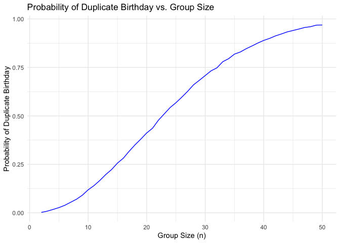

p8105_hw5_mw3845
================
Minghe Wang
2024-11-14

# Problem 1

``` r
check_duplicate_bd <- function(n) {
  # Simulate uniformly distributed birthday with size n
  birthdays <- sample(1:365, n, replace = TRUE)
  # Check duplicate
  return(any(duplicated(birthdays)))
}
#Simulate each size 10000 times
sim_num = 10000
group_size = 2:50
prob = numeric(length(group_size))

for (i in seq_along(group_size)){
  n = group_size[i]
  results = replicate(sim_num, check_duplicate_bd(n))
  prob[i] = mean(results)
}

########################
#test
data <- data.frame(GroupSize = group_size, Probability = prob)

# Create the plot
ggplot(data, aes(x = GroupSize, y = Probability)) +
  geom_line(color = 'blue') +
  #geom_point(color = 'blue') +
  labs(title = 'Probability of Duplicate Birthday vs. Group Size',
       x = 'Group Size (n)',
       y = 'Probability of Duplicate Birthday') +
  theme_minimal()
```

<!-- -->

In this problem, we simulate a problem to measure the probability of
duplicate birthday among the group of `n` people. According to the plot,
we see a positive relationship between `group_size` and
`probability_of_duplicate_birthday`. The result aligns with our
intuition that with more people in a group, there are more likely to be
people with duplicate birthday.

\#Problem 2
