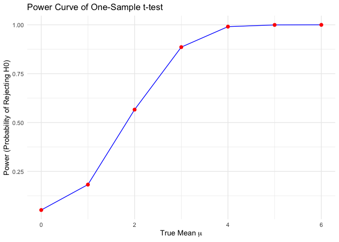
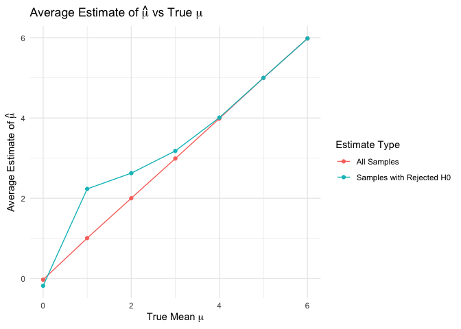
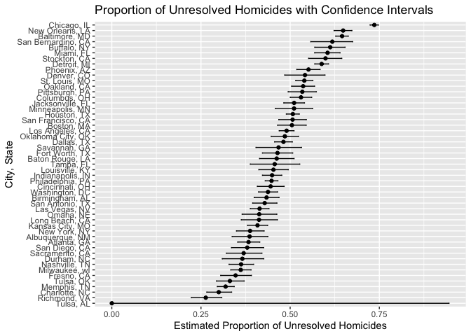

p8105_hw5_mw3845
================
Minghe Wang
2024-11-14

# Problem 1

``` r
check_duplicate_bd <- function(n) {
  # Simulate uniformly distributed birthday with size n
  birthdays <- sample(1:365, n, replace = TRUE)
  # Check duplicate
  return(any(duplicated(birthdays)))
}
#Simulate each size 10000 times
sim_num = 10000
group_size = 2:50
prob = numeric(length(group_size))

for (i in seq_along(group_size)){
  n = group_size[i]
  results = replicate(sim_num, check_duplicate_bd(n))
  prob[i] = mean(results)
}

########################
#test
data <- data.frame(GroupSize = group_size, Probability = prob)

# Create the plot
ggplot(data, aes(x = GroupSize, y = Probability)) +
  geom_line(color = 'blue') +
  #geom_point(color = 'blue') +
  labs(title = 'Probability of Duplicate Birthday vs. Group Size',
       x = 'Group Size (n)',
       y = 'Probability of Duplicate Birthday') +
  theme_minimal()
```

<!-- -->

In this problem, we simulate a problem to measure the probability of
duplicate birthday among the group of `n` people. According to the plot,
we see a positive relationship between `group_size` and
`probability_of_duplicate_birthday`. The result aligns with our
intuition that with more people in a group, there are more likely to be
people with duplicate birthday.

\#Problem 2

``` r
#fixed parameters for simulation
n = 30                              #fixed sample size
sigma = 5                           #fixed sigma
ds_num = 5000                       #fixed number of datasets
alpha = 0.05

#Write function to get estimate and p-value for each dataset
sim_estimate_pval = function(mu, n = 30, sigma = 5){
  
  sim_data = tibble(
    x = rnorm(n, mean = mu, sd = sigma)
  )
  
  t.test(sim_data$x, mu = 0) %>% 
    broom::tidy() %>% 
    select(estimate, p.value)
}

sim_results_df = 
  expand_grid(
    mu_vec = c(0, 1, 2, 3, 4, 5, 6),
    iter = 1:ds_num
  ) |> 
  mutate(
    estimate_df = map(mu_vec, sim_estimate_pval)
  ) |> 
  unnest(estimate_df)

sim_results_df |> 
  pivot_longer(
    estimate:p.value,
    names_to = "parameter", 
    values_to = "estimate") |> 
  group_by(parameter, mu_vec) |> 
  summarize(
    emp_mean = mean(estimate),
    emp_var = var(estimate)) |> 
  knitr::kable(digits = 5)
```

    ## `summarise()` has grouped output by 'parameter'. You can override using the
    ## `.groups` argument.

| parameter | mu_vec | emp_mean | emp_var |
|:----------|-------:|---------:|--------:|
| estimate  |      0 | -0.01865 | 0.81685 |
| estimate  |      1 |  0.97626 | 0.81481 |
| estimate  |      2 |  1.99851 | 0.80550 |
| estimate  |      3 |  3.00680 | 0.85284 |
| estimate  |      4 |  3.98929 | 0.81536 |
| estimate  |      5 |  5.01065 | 0.82543 |
| estimate  |      6 |  6.00642 | 0.85700 |
| p.value   |      0 |  0.50069 | 0.08245 |
| p.value   |      1 |  0.35078 | 0.08823 |
| p.value   |      2 |  0.11743 | 0.03508 |
| p.value   |      3 |  0.02380 | 0.00457 |
| p.value   |      4 |  0.00284 | 0.00016 |
| p.value   |      5 |  0.00028 | 0.00000 |
| p.value   |      6 |  0.00002 | 0.00000 |

With the table containing empirical mean and variance for estimate and
p-value, we expect an positive association between the power and $\mu$
because the p-value decreases as $\mu$ increases. This assumption will
be verified in later part.

``` r
power_df <- sim_results_df %>%
  group_by(mu_vec) %>%
  summarize(
    power = mean(p.value < alpha)
  )

ggplot(power_df, aes(x = mu_vec, y = power)) +
  geom_line(color = 'blue') +
  geom_point(color = 'red', size = 2) +
  labs(title = 'Power Curve of One-Sample t-test',
       x = expression('True Mean ' * mu),
       y = 'Power (Probability of Rejecting H0)') +
  theme_minimal()
```

<!-- -->

By calculating the proportion of times the null hypothesis was rejected
for each true mean value, we’ve constructed a power curve that
illustrates the association between effect size and power. The positive
association confirms that larger effect sizes lead to higher power,
which aligns with theoretical expectations.

``` r
# Calculate average estimate for all samples
average_estimate_df = sim_results_df %>%
  group_by(mu_vec) %>%
  summarise(
    avg_estimate = mean(estimate)
  )

# Calculate average estimate for samples where null was rejected
average_estimate_rejected_df = sim_results_df %>%
  filter(p.value < alpha) %>%
  group_by(mu_vec) %>%
  summarise(
    avg_estimate_rejected = mean(estimate)
  )

combined_estimate_df = left_join(average_estimate_df, average_estimate_rejected_df, by = "mu_vec") %>% 
  pivot_longer(
    cols = c(avg_estimate, avg_estimate_rejected),
    names_to = "Estimate_Type",
    values_to = "Average_Estimate"
  )

combined_estimate_df$Estimate_Type = recode(
  combined_estimate_df$Estimate_Type,
  "avg_estimate" = "All Samples",
  "avg_estimate_rejected" = "Samples with Rejected H0"
)

# Plot the average estimates
ggplot(combined_estimate_df, aes(x = mu_vec, y = Average_Estimate, color = Estimate_Type)) +
  geom_line() +
  geom_point() +
  labs(
    title = expression('Average Estimate of ' * hat(mu) * ' vs True ' * mu),
    x = expression('True Mean ' * mu),
    y = expression('Average Estimate of ' * hat(mu)),
    color = "Estimate Type"
  ) +
  theme_minimal()
```

<!-- -->

\#Problem 3

``` r
homocide_df = read.csv("./homicide-data.csv")

homicide_summary_df = homocide_df %>% 
  mutate(
    city_state = paste(city, state, sep = ", ")
  ) %>% 
  group_by(city_state) %>% 
  summarise(
    total_homicide = n(),
    unresolved_homicide = sum(disposition %in% c("Closed without arrest", "Open/No arrest"))
  )
```

``` r
# Select Baltimore's data
baltimore_df = homicide_summary_df %>% 
  filter(city_state == "Baltimore, MD")

# Use prop.test for the proportion of unresolved homicides
baltimore_result = 
  prop.test(
  x = pull(baltimore_df, unresolved_homicide),
  n = pull(baltimore_df, total_homicide)
) %>% 
  broom::tidy() %>% 
  select(
    estimate, conf.low, conf.high
  ) %>% 
  janitor::clean_names()

baltimore_result
```

    ## # A tibble: 1 × 3
    ##   estimate conf_low conf_high
    ##      <dbl>    <dbl>     <dbl>
    ## 1    0.646    0.628     0.663

``` r
# Conduct prop.test on other cities
homicide_result = homicide_summary_df %>% 
  mutate(
    prop_test_result = map2(
      unresolved_homicide, total_homicide, \(unres, tot) prop.test(x = unres, n = tot) %>% 
      broom::tidy()
    )
  ) %>% 
  unnest(prop_test_result) %>% 
  select(
    city_state,
    estimate,
    conf.low,
    conf.high
  ) %>% 
  janitor::clean_names()
```

    ## Warning: There was 1 warning in `mutate()`.
    ## ℹ In argument: `prop_test_result = map2(...)`.
    ## Caused by warning in `prop.test()`:
    ## ! Chi-squared approximation may be incorrect

``` r
# Plotting proportion of unresolved homicide for cities
homicide_result %>% 
  arrange(estimate) %>% 
  ggplot(aes(x = reorder(city_state, estimate), y = estimate)) +
  geom_point() +
  geom_errorbar(aes(ymin = conf_low, ymax = conf_high), width = 0.2) +
  coord_flip() +
  labs(
    title = "Proportion of Unresolved Homicides with Confidence Intervals",
    x = "City, State",
    y = "Estimated Proportion of Unresolved Homicides"
  ) 
```

<!-- -->
